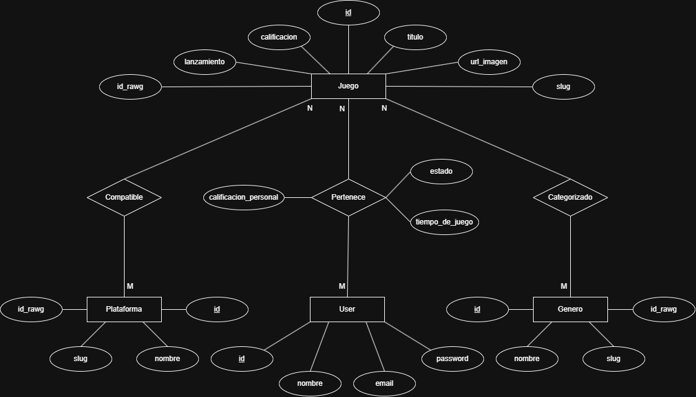

# Club Gamer - Proyecto Segundo Parcial
## Materia: Programación III - Primer Cuatrimestre, 2do año 📚

## 🎮 ¿Qué es Club Gamer?

Club Gamer es una aplicación web full-stack desarrollada para gestionar una colección personal de videojuegos. El objetivo principal del sistema es permitir que un usuario pueda consultar un catálogo de juegos, agregar títulos a su propia colección y registrar información relacionada con su progreso dentro de cada juego.

La aplicación está pensada como una herramienta de organización para jugadores, tomando como referencia plataformas modernas de seguimiento de videojuegos. A través del sistema, cada usuario podrá clasificar sus juegos según estado, plataforma y género, además de registrar datos personales como calificación y cantidad de horas jugadas.

El proyecto fue desarrollado como trabajo práctico para la cátedra de Programación III en la UTN FRBB. En esta segunda entrega se trabaja sobre una arquitectura full-stack compuesta por un frontend en React, un backend en Node.js con Express, una base de datos PostgreSQL administrada mediante Sequelize y un entorno de ejecución basado en Docker Compose.

Durante la primera etapa del desarrollo, el foco está puesto principalmente en el backend y la base de datos. Por este motivo, se prioriza la creación de modelos, migraciones, seeders, rutas REST, controladores, validaciones, documentación técnica y pruebas manuales de la API.

## ✨ Características Principales

- Catálogo general de videojuegos.
- Alta, consulta y modificación de videojuegos.
- Gestión de plataformas disponibles.
- Gestión de géneros asociados a los videojuegos.
- Asociación de videojuegos con múltiples plataformas.
- Asociación de videojuegos con múltiples géneros.
- Colección personal de videojuegos por usuario.
- Registro del estado de cada videojuego dentro de la colección.
- Estados posibles: pendiente, jugando o completado.
- Registro de calificación personal.
- Registro de horas jugadas.
- Filtros de búsqueda por título, plataforma, género y año.
- Paginación de resultados.
- API REST desarrollada con Express.
- Base de datos relacional con PostgreSQL.
- Modelado de datos mediante Sequelize.
- Entorno de desarrollo contenerizado con Docker Compose.
- Administración visual de base de datos mediante pgAdmin.
- Documentación de endpoints mediante Postman.
- Pruebas manuales documentadas en `API_test.md`.

## 🧩 Alcance de la Primera Etapa

La primera etapa del proyecto se centra en el desarrollo del backend y la base de datos. El objetivo es dejar preparada una API REST funcional que permita administrar las entidades principales del sistema y probarlas de forma manual mediante Postman o comandos curl.

Para esta entrega se trabaja sobre las siguientes áreas:

- Modelado de entidades con Sequelize.
- Creación de migraciones y seeders.
- Desarrollo de controladores y rutas para la API.
- CRUD de plataformas.
- CRUD de géneros.
- CRUD de videojuegos.
- Gestión de la colección personal del usuario.
- Validaciones de entrada.
- Manejo básico de errores HTTP.
- Documentación técnica del proyecto.
- Documentación de pruebas manuales de la API.

Algunas funcionalidades, como autenticación JWT completa, integración definitiva con RAWG, frontend completo y testing automatizado con Jest, quedan previstas para etapas posteriores del desarrollo.

## 👥 Integrantes - Grupo 19
- [@fedeheinrich](https://github.com/fedeheinrich) - Federico Heinrich
- [@Oviedo-Matias](https://github.com/Oviedo-Matias) - Matias Oviedo
- [@Tincho2319](https://github.com/Tincho2319) - Martin Alcaraz
- [@Nahuelete](https://github.com/Nahuelete) - Nahuel Cappa
- [@nicc-essp](https://github.com/nicc-essp) - Nicolas Espulef
- [@HomeroColomboArg](https://github.com/HomeroColomboArg) - Homero Colombo

## 🛠️ Metodología de Trabajo

Para mantener el repositorio organizado entre los seis, utilizamos la estrategia de ramificación **Git Flow** y los **estandares de contribución** detallados más abajo.

### Estrategia de Ramificación Git Flow

* main: Código en su version estable y completa (V1.0).

* release/x.0 : Preparacion de una nueva version. Se crea cuando develop tiene suficientes funcionalidades para una entrega, sirve para corregir errores menores durante la revision, ajustar numeros de version, actualizar documentacion y **IMPORTANTE: no agregar funcionalidades nuevas**.
    > *Se crea desde **develop***, y una vez que se completa el trabajo en dicha rama (obtenemos la version estable) se realiza el merge a develop y a main para actualizar el codigo en ambas ramas.
* develop: rama de desarrollo.

* feature/nombre-de-la-funcionalidad: Para crear nuevas funcionalidades. 
    > *Se crea desde **develop*** para trabajar en una nueva funcion a implementar. Una vez completada la funcionalidad, se hace el merge a develop y se elimina la rama.

* hotfix: Correcion urgente de un error que se encuentra en main.
    > Cuando encontramos un error importante en la version estable, *se crea desde **main*** para trabajar en la correcion del error y solucionarlo lo antes posible. Una vez corregido el bug, se hace el merge a main y a develop.

### Estandares de contribución

- **Commits**: Utilizar titulos descriptivos con el formato `tipo: descripción`. 
    > Ejemplo: `feat: implementación de login` o `fix: corrección de ruta API`.

- **Revisiones de Pull Requests (PR)**: Al menos un compañero de equipo debe revisar una solicitud de incorporacion de cambios antes de fusionarla (merge) con develop.

## 📂 Estructura del Proyecto

```text
clubgamer/
│
├── .gitignore
├── API_test.md                          # Guía de pruebas y ejemplos de uso de la API.
├── docker-compose.yml                   # Orquestación de servicios Docker.
├── LICENSE                              # Licencia del proyecto.
├── rd.md
├── README.md                            # Documentación principal del proyecto.
│
├── backend/
│   ├── .env.example                     # Plantilla de variables de entorno.
│   ├── Dockerfile                       # Imagen Docker para producción.
│   ├── Dockerfile.dev                   # Imagen Docker para desarrollo.
│   ├── package.json                     # Dependencias y scripts del backend.
│   ├── server.js                        # Punto de entrada del servidor Express.
│   │
│   ├── config/
│   │   ├── config.js                    # Configuración general de Sequelize.
│   │   └── database.js                  # Configuración de conexión a PostgreSQL.
│   │
│   ├── controllers/                     # Lógica de negocio de la API.
│   │   ├── authController.js
│   │   ├── coleccionController.js
│   │   ├── generoController.js
│   │   ├── plataformasController.js
│   │   ├── userController.js
│   │   └── videojuegosController.js
│   │
│   ├── middleware/                      # Middlewares de autenticación y validaciones.
│   │   └── auth.js
│   │
│   ├── migrations/                      # Migraciones de la base de datos.
│   │   ├── 01-User.js
│   │   ├── 02-Plataforma.js
│   │   ├── 03-Genero.js
│   │   ├── 04-Juego.js
│   │   ├── 05-JuegoUser.js
│   │   ├── 06-JuegoGenero.js
│   │   └── 07-JuegoPlataforma.js
│   │
│   ├── models/                          # Modelos Sequelize y relaciones.
│   │   ├── User.js
│   │   ├── Juego.js
│   │   ├── Genero.js
│   │   ├── Plataforma.js
│   │   ├── JuegoUser.js
│   │   ├── JuegoGenero.js
│   │   ├── JuegoPlataforma.js
│   │   └── index.js
│   │
│   ├── routes/                          # Definición de endpoints REST.
│   │   ├── auth.js
│   │   ├── colecciones.js
│   │   ├── generos.js
│   │   ├── plataformas.js
│   │   ├── user.js
│   │   ├── videojuegos.js
│   │   └── index.js
│   │
│   ├── seeders/                         # Datos iniciales para pruebas y desarrollo.
│   │   ├── 01-Users.js
│   │   ├── 02-Juegos.js
│   │   ├── 03-Generos.js
│   │   ├── 04-Plataformas.js
│   │   └── 05-JuegosUsers.js
│   │
│   ├── tests/                           # Pruebas automatizadas del backend.
│   │
│   └── utils/
│       └── rawgHelper.js                # Integración con la API RAWG.
│
├── frontend/
│   ├── .env.development                 # Variables de entorno del frontend.
│   ├── craco.config.js                  # Configuración de CRACO.
│   ├── Dockerfile                       # Imagen Docker para producción.
│   ├── Dockerfile.dev                   # Imagen Docker para desarrollo.
│   ├── package.json                     # Dependencias y scripts del frontend.
│   │
│   ├── public/
│   │   └── index.html                   # Plantilla HTML principal.
│   │
│   └── src/
│       ├── App.js
│       ├── App.css
│       ├── index.js
│       ├── index.css
│       │
│       ├── assets/
│       │   ├── icons/                   # Íconos del proyecto.
│       │   └── images/                  # Imágenes y recursos gráficos.
│       │       └── clubgamer-logo.png
│       │
│       ├── components/
│       │   ├── common/                  # Componentes reutilizables.
│       │   ├── layout/                  # Componentes de estructura visual.
│       │   └── ui/                      # Componentes de interfaz.
│       │
│       ├── hooks/                       # Hooks personalizados de React.
│       ├── pages/                       # Páginas principales de la aplicación.
│       ├── services/                    # Servicios de comunicación con la API.
│       ├── styles/                      # Estilos globales y específicos.
│       └── utils/                       # Funciones auxiliares del frontend.
│
├── database/
│   └── init.sql                         # Script de inicialización de PostgreSQL.
│
├── pgadmin/
│   ├── Dockerfile                       # Imagen Docker de pgAdmin.
│   ├── pgpass                           # Credenciales de acceso a PostgreSQL.
│   ├── servers-with-password.json       # Configuración automática con contraseña.
│   └── servers.json                     # Configuración automática de servidores.
│
├── caddy/
│   └── Caddyfile                        # Configuración del proxy reverso Caddy.
```


## 🗂️ División de Archivos

A continuación, se detalla la responsabilidad de cada integrante sobre los principales módulos del repositorio:

| Responsable | Archivos y Carpetas Principales | Funcionalidad / Módulo |
| :--- | :--- | :--- |
| **Federico Heinrich** | `backend/controllers/plataformasController.js`, `backend/routes/plataformas.js`, `backend/routes/index.js` | Configuración inicial del repositorio, arquitectura base del backend y gestión de plataformas (CRUD y endpoints). |
| **Matías Oviedo** | `backend/models/*`, `backend/migrations/*`, `backend/seeders/*` | Modelado de datos, relaciones Sequelize, migraciones, seeders e integración de la estructura de almacenamiento para RAWG. |
| **Martín Alcaraz** | `backend/controllers/videojuegosController.js`, `backend/controllers/coleccionController.js`, `backend/routes/videojuegos.js`, `backend/routes/colecciones.js`, `backend/utils/rawgHelper.js` | Gestión de videojuegos, colecciones de usuario, integración con PostgreSQL e intermediario con la API RAWG. |
| **Nahuel Cappa** | `backend/tests/*`, `API_test.md`, `backend/middleware/*` | Validaciones de entrada, testing manual y documentación de pruebas de la API. |
| **Homero Colombo** | `README.md`, `postman_collection.json`, documentación de Postman y scripts de pruebas automatizadas | Documentación técnica del proyecto, colección Postman y testing automatizado. |
| **Nicolás Espulef** | `docker-compose.yml`, `.env.example`, configuración de Render y despliegue | Infraestructura, despliegue del backend y base de datos, configuración de entornos y variables de entorno. |


## 🏗️ Arquitectura General

Club Gamer utiliza una arquitectura cliente-servidor compuesta por un frontend desarrollado en React, un backend basado en Express y una base de datos PostgreSQL administrada mediante Sequelize.

El backend expone una API REST encargada de procesar las solicitudes del cliente, aplicar la lógica de negocio y gestionar la persistencia de los datos. Por su parte, el frontend consume los endpoints de la API para mostrar y modificar la información de la colección de videojuegos.

Adicionalmente, el sistema incorpora integración con la API pública de RAWG para obtener información actualizada de videojuegos cuando estos no se encuentran almacenados localmente en la base de datos.

```text
Usuario
   │
   ▼
Frontend (React)
   │
   ▼
Backend (Express)
   │
   ├── PostgreSQL
   │
   └── API RAWG
```

## 🛠️ Tecnologías Utilizadas

### Backend

- Node.js
- Express
- Sequelize
- PostgreSQL
- JWT
- bcryptjs
- express-validator
- cors
- helmet
- dotenv
- morgan

### Frontend

- React
- Axios
- React Router

### Infraestructura

- Docker
- Docker Compose
- pgAdmin
- Redis

### Testing y Documentación

- Postman
- Jest
- Supertest

## 🚀 Instalación y Ejecución

### Requisitos previos

Para ejecutar el proyecto de forma local es necesario contar con:

- Git
- Docker
- Docker Compose
- Node.js, en caso de ejecutar servicios fuera de Docker
- Una API Key de RAWG

### Clonar el repositorio

```bash
git clone https://github.com/fedeheinrich/clubgamer.git
cd clubgamer
```

### Cambiar a la rama de desarrollo

```bash
git checkout develop
```

### Configurar variables de entorno

Antes de levantar el backend, se debe crear un archivo `.env` dentro de la carpeta `backend/`.

Se recomienda tomar como referencia el archivo:

```txt
backend/.env.example
```

### Levantar los servicios con Docker

Desde la raíz del proyecto:

```bash
docker compose build
docker compose up -d
```

### Verificar que el backend funciona

Una vez levantados los servicios, se puede verificar el estado de la API accediendo a:

```txt
http://localhost:3001/api/health
```

Respuesta esperada:

```json
{
  "status": "OK",
  "message": "API funcionando correctamente",
  "timestamp": "2024-XX-XXTXX:XX:XX.XXXZ",
  "environment": "development"
}
```

### Detener los servicios

```bash
docker compose down
```

Para detener los servicios y eliminar los volúmenes de la base de datos:

```bash
docker compose down -v
```

## ⚙️ Configuración del Entorno

El backend utiliza variables de entorno para definir la configuración del servidor, la conexión a la base de datos, la integración con RAWG y valores necesarios para autenticación.

El archivo `.env` debe crearse dentro de la carpeta `backend/` y no debe subirse al repositorio.

### Variables disponibles

| Variable | Descripción |
|-----------|-------------|
| PORT | Puerto utilizado por el servidor Express. |
| NODE_ENV | Entorno de ejecución de la aplicación. |
| DB_HOST | Host de la base de datos PostgreSQL. |
| DB_PORT | Puerto de PostgreSQL. |
| DB_NAME | Nombre de la base de datos. |
| DB_USER | Usuario de PostgreSQL. |
| DB_PASSWORD | Contraseña del usuario de PostgreSQL. |
| RAWG_API_KEY | Clave de acceso a la API RAWG. |
| JWT_SECRET | Clave utilizada para la autenticación JWT. |
| CORS_ORIGIN | Origen permitido para las solicitudes CORS. |

### Ejemplo de archivo `.env`

```env
PORT=3001
NODE_ENV=development

DB_HOST=localhost
DB_PORT=5432
DB_NAME=app_database
DB_USER=app_user
DB_PASSWORD=app_password

RAWG_API_KEY=ACA_PONES_TU_CLAVE_DE_RAWG

JWT_SECRET=secreto_jwt_clubgamer_2024
CORS_ORIGIN=http://localhost:3000
```

> El archivo `.env` se encuentra excluido del control de versiones mediante `.gitignore`, ya que puede contener credenciales, claves privadas o información sensible.

## 🗄️ Base de Datos

La base de datos utiliza PostgreSQL como sistema gestor y Sequelize como ORM principal.

El sistema se encuentra modelado mediante entidades relacionales que representan videojuegos, usuarios, géneros, plataformas y las relaciones entre ellos.





### Entidades Principales

| Entidad | Descripción |
|----------|----------|
| User | Usuarios registrados en la aplicación |
| Juego | Catálogo general de videojuegos |
| Genero | Géneros asociados a los videojuegos |
| Plataforma | Plataformas disponibles |
| JuegoUser | Relación entre usuarios y videojuegos |
| JuegoGenero | Relación entre videojuegos y géneros |
| JuegoPlataforma | Relación entre videojuegos y plataformas |

### Relaciones

- Un videojuego puede pertenecer a múltiples géneros.
- Un género puede estar asociado a múltiples videojuegos.
- Un videojuego puede estar disponible en múltiples plataformas.
- Una plataforma puede contener múltiples videojuegos.
- Un usuario puede registrar múltiples videojuegos en su colección.
- Un videojuego puede formar parte de la colección de múltiples usuarios.

## Endpoints y Documentación en Postman

[](https://documenter.getpostman.com/view/50343050/2sBXwvK94A)

## 📡 API REST

La aplicación expone una API REST desarrollada con Express para administrar los recursos principales del sistema.

### Endpoints del Sistema

| Método | Endpoint | Descripción |
|----------|----------|----------|
| GET | /api/health | Verifica el estado del servidor |
| GET | /api/test | Endpoint de prueba |

### Endpoints de Plataformas

| Método | Endpoint |
|----------|----------|
| GET | /api/plataformas |
| GET | /api/plataformas/:id |
| POST | /api/plataformas |
| PUT | /api/plataformas/:id |
| DELETE | /api/plataformas/:id |

### Endpoints de Géneros

| Método | Endpoint |
|----------|----------|
| GET | /api/generos |
| GET | /api/generos/:id |
| POST | /api/generos |
| PUT | /api/generos/:id |
| DELETE | /api/generos/:id |

### Endpoints de Videojuegos

| Método | Endpoint |
|----------|----------|
| GET | /api/videojuegos |
| GET | /api/videojuegos/:id |
| POST | /api/videojuegos |
| PUT | /api/videojuegos/:id |
| DELETE | /api/videojuegos/:id |

### Endpoints de Colecciones

| Método | Endpoint |
|----------|----------|
| GET | /api/colecciones |
| POST | /api/colecciones |
| PUT | /api/colecciones/:id_juego |
| DELETE | /api/colecciones/:id_juego |

### Endpoints de Autenticación

| Método | Endpoint |
|----------|----------|
| POST | /api/auth/register |
| POST | /api/auth/login |
| GET | /api/auth/perfil |

## 🔗 Integración con RAWG

Club Gamer utiliza la API pública de RAWG como fuente de información de videojuegos.

Cuando un videojuego es solicitado por el sistema:

1. Se busca primero en la base de datos local.
2. Si existe, se devuelve inmediatamente.
3. Si no existe, se consulta la API de RAWG.
4. La información obtenida se almacena en PostgreSQL.
5. El resultado es devuelto al cliente.

Este mecanismo reduce consultas externas y permite construir progresivamente un catálogo local de videojuegos.

## 📚 Documentación

- 📖 [README.md](README.md) — Documentación principal del proyecto.
- 🧪 [API_test.md](API_test.md) — Casos de prueba y ejemplos de uso de la API.
- 📜 [LICENSE](LICENSE) — Licencia del proyecto.
- 📮 [Documentación Postman](https://documenter.getpostman.com/view/50343050/2sBXwvK94A) — Colección y documentación interactiva de endpoints.

Las pruebas manuales de la API pueden realizarse mediante Postman o utilizando los ejemplos documentados en API_test.md.

